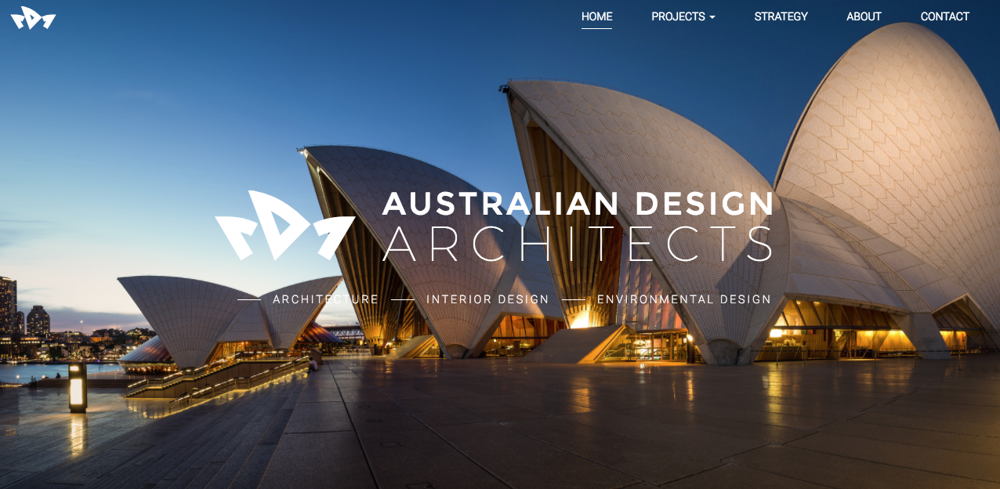
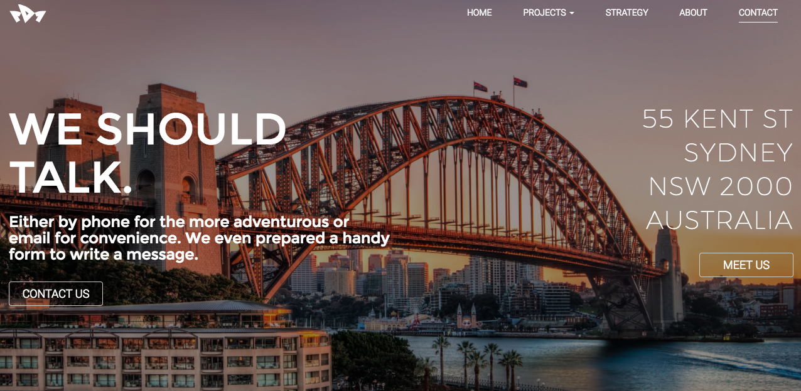

# Australian Designs Architects

**Note:** This is a fictitious project.
The project was to create a portfolio site for an architects organisation. The site is built mostly on PHP, with Bootstrap for styling and JavaScript. The design, logo and brand creation was also created from scratch. **[Live Version](https://mmaddocks.com/projects/ada/)

- PHP
- JavaScript
- Bootstrap 
- CSS

** Feedback is welcomed :)

  

  

